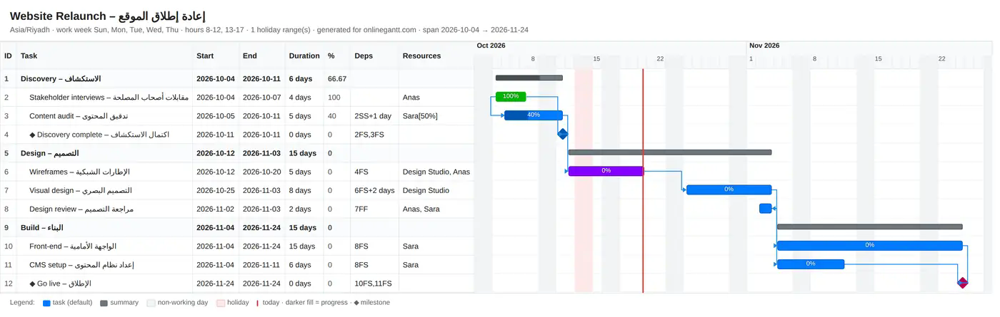
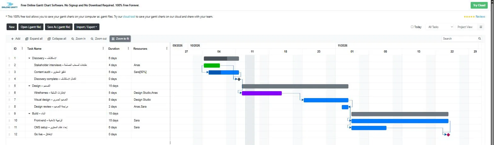
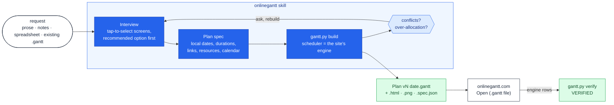

<p align="center">
  <picture>
    <source media="(prefers-color-scheme: dark)" srcset="plugins/onlinegantt/assets/logo-dark.svg">
    <source media="(prefers-color-scheme: light)" srcset="plugins/onlinegantt/assets/logo-light.svg">
    
  </picture>
</p>

<h1 align="center">onlinegantt</h1>

<p align="center"><strong>Turn a project description, an existing plan or a spreadsheet into a correct <code>.gantt</code> file for onlinegantt.com — interview-driven, scheduled exactly like the site's engine, previewed as HTML and PNG, and verified on the site itself.</strong></p>

<p align="center">
  <em>Claude Code plugin &middot; agent skill for Claude Code and Cowork &middot; v1.0.0</em> &middot;
  <a href="#license">MIT</a> &middot;
  <a href="#install">Install</a> &middot;
  <a href="plugins/onlinegantt/SKILL.md">Skill spec</a> &middot;
  <a href="plugins/onlinegantt/references/gantt-format.md">The <code>.gantt</code> format</a>
</p>

---

> **An independent project.** This skill is not affiliated with, endorsed by or supported by
> onlinegantt.com. It targets the site's free tool (`https://www.onlinegantt.com/#/gantt`), whose plans live
> entirely in a `.gantt` file the user opens and saves. The file format and the scheduling behaviour the skill
> reproduces were verified against the public site on **2026-09-13**; the site may change after that date,
> and `gantt.py verify` exists so you can re-check at any time.

## What it is

<p align="center">
  
</p>

onlinegantt.com's free Gantt tool has no API and no cloud storage: a plan is one JSON file (`.gantt`) that
you **Open** and **Save As**. Writing that file by hand goes wrong in quiet ways — dates written at midnight
land at 08:00 the next working day, a dependency silently moves the task you dated, a link on a phase is
dropped, a resource that is not declared renders blank, and every timestamp shifts when the file is opened
in another timezone. The site re-schedules everything on load, so what you wrote is not what you see.

This skill makes Claude produce those files correctly, and everything around them:

- **Create** a plan from prose, notes or a spreadsheet — phases, tasks, milestones, durations, owners,
  dependencies with lags, progress, colours, notes, a working calendar with holidays, the site's display
  settings.
- **Edit** an existing plan as a new version (ids stable, the original untouched): add or move tasks,
  shift work, reassign people, insert a phase, overlap two tasks, mark things done.
- **Ask before assuming.** Everything the request leaves open — timezone, working week, hours, holidays,
  date format, language of the names, colour scheme, team, allocation units, images, where to save, the file
  name, missing durations, inferred links, conflicts, over-allocation — is asked as tap-to-select screens
  with a recommended option, never guessed.
- **Schedule like the site.** A standard-library Python scheduler reproduces the engine: working-time
  snapping, weekends and holidays, FS/SS/FF/SF links with day- and hour-lags in both directions, parent
  roll-up, timezone conversion. The file the skill writes is the file the site shows.
- **Preview and analyse**: a self-contained HTML timeline, PNG images (whole plan fit to width, day scale,
  table only), the critical path, overdue / at-risk tasks as of a date, per-person workload and
  over-allocation.
- **Convert**: the site's CSV export format in both directions, user spreadsheets (`.csv`, `.tsv`, `.xlsx`)
  with a *Depends on* column into a plan, ambiguous dates flagged.
- **Operate the site**: click-by-click steps for Open, Save As, Import/Export (CSV, PDF, image) and
  settings, or drive the site in a browser — load a file through the site's own Open handler, dump what the
  engine rendered and compare it field for field with the file (`VERIFIED`).

The same file, opened on onlinegantt.com (**Open (.gantt file)**, then *Zoom to fit*) — the columns, date
format, holiday, 50 % allocation and every date are the ones the skill wrote:

<p align="center">
  
</p>

```text
$ python3 scripts/gantt.py verify "Website Relaunch v1 2026-09-13.gantt" engine-rows.json
VERIFIED - the site renders every task exactly as stored
ok       task 1 'Discovery – الاستكشاف'
ok       task 2 'Stakeholder interviews – مقابلات أصحاب المصلحة'
ok       task 3 'Content audit – تدقيق المحتوى'
…
ok       task 12 'Go live – الإطلاق'
```

## Requirements

- **Claude Code** (the plugin path below) or **Claude Cowork** with the skill installed. Both provide the
  `AskUserQuestion` tool the interview screens use; without it the skill prints the same screens as numbered
  lists.
- **Python 3.9+**, standard library only — the scripts have no dependencies. CI runs the suite on
  3.9–3.13 (Ubuntu) and 3.12 (Windows — `python` instead of `python3` there; a timezone name needs the
  `tzdata` package or an explicit `utcOffset` in the spec).
- **Optional — PNG images:** Playwright + Chromium (`pip install playwright && playwright install chromium`,
  ~150 MB). The scripts never install anything: when the renderer is missing they print the command and the
  skill asks you first. HTML previews need nothing.
- **Optional — verification on the site:** a browser tool (the Cowork built-in browser or Claude in Chrome).

## Install

The skill ships as a self-contained bundle at [`plugins/onlinegantt/`](plugins/onlinegantt). This repository
is its own Claude Code plugin marketplace:

```text
/plugin marketplace add A-H-911/onlinegantt
/plugin install onlinegantt@onlinegantt
```

Then invoke it as **`/onlinegantt:onlinegantt`** (plugin skills are namespaced), or just ask — the skill
triggers on its own for anything that mentions onlinegantt, a `.gantt` file, a Gantt chart, a project plan,
schedule, timeline or roadmap, dependencies, progress or resource assignments. Update later with
`/plugin update onlinegantt@onlinegantt`.

## Usage, by example

The skill runs a short interview first (one shortcut screen, then only what the request leaves open), shows
a draft table of phases, tasks, milestones and the links it inferred, builds the file, resolves conflicts and
workload with you, delivers `.gantt` + `.html` + `.png` + `.spec.json`, and verifies on the site when a
browser is available.

**Create a plan from a description.**

```text
Make a plan for relocating our office to the new building in Riyadh. Kick-off mid-November,
move over the first weekend of December, Anas leads, Sara handles packing, Khalid does IT,
a moving company does the transport.
```

The skill asks the shortcut question (*Use all recommended values* / *Ask me each question*), then the
plan-specific ones: the exact kick-off date (first working day of that week recommended), how to show work on
the Friday–Saturday moving weekend (the site has one calendar per plan — open only those days, or model it on
the nearest working days; no recommendation, both are legitimate), holidays, the team (the moving company as a
named resource, an "(external)" label, bilingual, or notes only), allocation units, images, save location and
file name. Missing durations and owners come back as a proposal table with one confirm question, the draft
with its inferred links as another, and then:

```text
Plan: Riyadh Office Relocation – انتقال مكتب الرياض — Riyadh Office Relocation v1 2026-09-13.gantt (+ .html, .png, .spec.json)
Span: 2026-11-15 → 2026-12-16 (26 working days) · 24 tasks / 3 milestones / 3 phases
Calendar: Asia/Riyadh, Sun–Thu with the 4–5 Dec moving weekend opened, 08–12 + 13–17, no holidays
Critical path: Kick-off → Inventory → Order packing materials → Floor plan → Notify staff → Final packing
  → Ready to move → Load & transport → Unload → Move complete → Unpack → Orientation → … → Relocation complete
Workload: Anas 24.5 d · Sara 24 d · Khalid 21 d · Moving company (external) 6 d — over-allocation: none
Verified on onlinegantt.com: yes — or the three clicks to open it there
Decisions taken from your answers: moving weekend opened · movers named "Moving company (external)" · Automatic: none
```

(The full build output of that plan, with all 30 rows, is [`examples/office-relocation/build-output.md`](examples/office-relocation/build-output.md).)

**Edit an existing plan.** Never overwrites; the edit becomes the next version with the same ids:

```text
Add a QA phase between Build and Go-live to "Website Relaunch v1 2026-09-13.gantt":
test plan (3 days, Anas), functional testing (6 days, Sara), bug fixing (4 days, Sara).
Content audit is done. Give CMS setup to Anas.
```

`decompile` → edit the spec → `build --version 2` → the summary reports what moved (go-live slips to
2026-12-13, the redundant Front-end → Go-live link replaced by Bug fixing → Go-live) and asks where the
*Go live* milestone should sit now that a phase precedes it.

**Questions about a plan.**

```text
What blocks the launch, and is anyone overloaded in November?
```

`inspect` prints the critical path, the links into the launch milestone, and the workload table with the
days each person exceeds 100 %.

**A spreadsheet into a plan.**

```text
Turn team_plan.xlsx into a Gantt. The "Depends on" column refers to row numbers.
```

`csv` maps the columns (aliases in English and Arabic), builds the hierarchy from a Phase column, remaps
*Depends on* to task ids, renumbers top-down and shows the mapping, and lists dates like `05/10/2026` for you
to say whether they are day-first or month-first.

**Images and conversions.**

```text
Give me an image of the plan with one column per day, and export it in the site's Excel format.
```

`preview --png day` and `csv` — the CSV is byte-compatible with the site's *Import from Excel File*.

**The site itself.**

```text
How do I hide the Duration column and switch to weekly zoom on onlinegantt.com?
```

Click-by-click from the site guide — or the setting goes into the spec and the file is rebuilt, which is
deterministic and keeps the file as the source of truth.

### The scripts

Everything the skill does with files goes through one command-line tool, usable on its own:

| command | does |
|---|---|
| `gantt.py build spec.json --out-dir D --version N [--png fit,day,table] [--today YYYY-MM-DD]` | plan spec → `<Plan> vN <date>.gantt` + HTML + PNG + spec copy; prints summary, critical path, status, workload. Exit 3 when a requested date and a dependency disagree (`--on-conflict deps\|lag\|dates` after you decide) |
| `gantt.py validate plan.gantt` | the errors the site would hit and `drift:` lines for tasks the engine will move on load |
| `gantt.py decompile plan.gantt -o spec.json` | an existing file back into the editable spec (local dates, readable durations) |
| `gantt.py inspect plan.gantt [--today …]` | span, task table, critical path, overdue / at-risk / upcoming, workload and over-allocation |
| `gantt.py preview plan.gantt [--mode fit\|day\|table] [--png …]` | self-contained HTML timeline, or PNG images through headless Chromium |
| `gantt.py csv plan.gantt` / `gantt.py csv sheet.xlsx -o spec.json` | the site's CSV format out; CSV/TSV/XLSX in |
| `gantt.py recolor plan.gantt --by phase --by status` | colour schemes after the fact (later schemes win; `--by clear` resets) |
| `gantt.py verify plan.gantt rows.json` | the file against rows dumped from the site's engine — `VERIFIED` or a per-task diff |
| `gantt.py name "Plan" 2` | the versioned file name |

The plan spec is documented in [`references/plan-spec.md`](plugins/onlinegantt/references/plan-spec.md);
[`examples/`](examples) holds four real ones with their outputs.

## How it works



<p align="center"><em>The skill never writes the file by hand: the interview settles what is open, the spec is the readable
source, the scheduler reproduces the site's engine, and the site's own rows prove the result.</em></p>

The bundle is **progressive-disclosure**: a short [`SKILL.md`](plugins/onlinegantt/SKILL.md) front door with
the workflows (create, edit, question, convert, operate the site) and the rules, plus `references/` loaded on
demand — the interview screens, the plan spec, the `.gantt` format and engine rules, the CSV format, the site
guide with browser recipes — and `scripts/`, a standard-library Python package (`ogantt/`: calendar
arithmetic, timezone handling, model, scheduler, file I/O and validation, inspection, preview, CSV,
recolouring, PNG rendering, verification).

What the scheduler knows about the site, all verified on the live engine on 2026-09-13:

| the site does | so the skill |
|---|---|
| snaps every start to working time (a Saturday or a 00:00 timestamp becomes the next working day 08:00) | writes working-time timestamps and warns when it had to move a date |
| lets a dependency override the stored date — a linked task sits at *predecessor + lag*, earlier or later | stops on a date/link conflict and asks which wins (`deps` / `lag` / `dates`) |
| drops links on and from summary tasks | only allows leaf-to-leaf links and refuses the rest |
| recomputes parent dates, duration and progress from the children | never lets you set them |
| renders an undeclared resource blank | declares every resource a task uses |
| shifts every timestamp to the file's timezone on open | stores the IANA name and offset the way the site does |
| has one calendar per plan and pushes work off non-working days | offers a 7-day week with the other off-days blocked, only when you choose it |
| stores holidays as local midnight in UTC, colours as one of 12 hues, notes as HTML, `Predecessor` as `"2FS+2 days"` | writes exactly those shapes (`references/gantt-format.md`) |

### Operating principles

1. **Nothing is assumed.** Whatever the request does not settle is asked, as a screen with 2–4 options and a
   recommendation, up to four questions at a time. Gaps in the plan itself come back as a proposal table with
   one confirm question; inferred links are shown as guesses for the user to keep or drop.
2. **Links beat dates; the scripts write the file.** Explicit dates only on anchor tasks; a task with a link
   gets its date from the link. `build` refuses files the site would mangle and stops on conflicts instead of
   picking a side.
3. **Every edit is a new version.** `<Plan name> vN YYYY-MM-DD.gantt`; ids never change, the original file is
   never overwritten, and the build input is kept beside the outputs (`.spec.json`) for the next edit.
4. **Verified, not assumed.** The scheduler is tested field for field against rows dumped from the site's
   engine (`tests/data/engine-fidelity.engine-rows.json`), and the skill re-verifies a real file on the site
   whenever a browser tool is available.
5. **Nothing installed, nothing signed up.** The PNG renderer is only installed after a yes; the skill never
   signs the user up for the site's cloud version or accepts its prompts.
6. **Defaults are recommendations, not decisions.** The recommended values (Asia/Riyadh, Sunday–Thursday,
   08–12 + 13–17, `yyyy-MM-dd`, bilingual English – Arabic names, fit-width PNG at 2×) live in one table in
   [`references/plan-interview.md`](plugins/onlinegantt/references/plan-interview.md) — change them there for
   your own team; the user still picks per plan.

## Tested

Two layers. `tests/` (31 stdlib `unittest` cases, run by `check.py` and by CI on Python 3.9–3.13 on Ubuntu
and 3.12 on Windows) covers engine fidelity against a live dump, calendar arithmetic and timezones, links and conflicts,
`workOn` calendars, milestone completion, spec errors, round-trips, CSV in both directions, inspection,
recolouring, previews, naming and the CLI exit codes. `evals/` holds four end-to-end prompts run with and
without the skill and graded mechanically ([`evals/results/iteration-2/benchmark.md`](evals/results/iteration-2/benchmark.md)):

| | with skill | without skill |
|---|---:|---:|
| assertions passed | **100 %** (45/45) | 59 % (26/45) |
| time per eval | 207 s | 587 s |
| tokens per eval | 91 k | 145 k |

Without the skill, Claude reverse-engineers the format each time and still produces files the site mangles
(midnight dates, non-palette colours, settings in the wrong shape, lost lags) or asks free-text questions
instead of screens; with it, every file validated, loaded unchanged and matched the engine.

## Repository structure

```text
onlinegantt/
├── .claude-plugin/marketplace.json   # this repo is its own plugin marketplace
├── plugins/onlinegantt/              # the self-contained skill bundle (the installable unit)
│   ├── .claude-plugin/plugin.json
│   ├── SKILL.md                      # entry point: workflows, rules, answer style
│   ├── references/                   # plan-interview, plan-spec, gantt-format, csv-format, site-guide
│   ├── scripts/gantt.py + ogantt/    # the CLI and the scheduler package (stdlib only)
│   └── assets/                       # example-plan.json, logos
├── examples/                         # four real plans: spec → .gantt + HTML + build output
├── evals/                            # the four prompts, the grader, inputs, iteration-2 results
├── tests/                            # the unittest suite + fixtures (incl. the live engine dump)
├── docs/assets/                      # README images
├── check.py                          # THE one gate — CI runs exactly this
└── .github/workflows/ci.yaml         # check.py on 3.9–3.13 × Linux/Windows + a PNG rendering job
```

## Verifying a local checkout

```bash
python check.py        # suites, lint, examples rebuilt byte-for-byte, eval results re-graded
```

## Contributing

Contributions are welcome — new interview screens for conventions the current ones miss, more engine
rules with a live dump to prove them, importers for other spreadsheet layouts, eval prompts, and worked
examples. See [`CONTRIBUTING.md`](CONTRIBUTING.md).

## Maturity

**v1.0.0.** The `.gantt` format, the engine rules and the scheduler are verified against the live site as
of 2026-09-13 and covered by tests; the interview screens encode the decisions of one team's use and are
meant to be edited. The skill has no dependencies and does not talk to the network; the site can change
under it, which `gantt.py verify` (and the engine-fidelity test, given a fresh dump) will show. Releases
are tagged `vX.Y.Z`, listed in [`CHANGELOG.md`](CHANGELOG.md), and each attaches `onlinegantt.skill`, the
packaged bundle. `SECURITY.md` states the trust model.

## License

Released under the **MIT License** — see [`LICENSE`](LICENSE). Plans you generate with it are yours.
